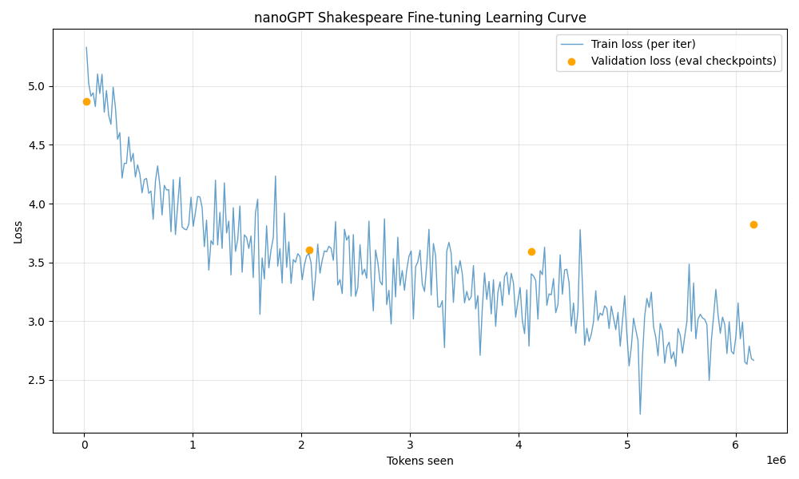

# Part 1 – Sophia Telephone Chain

**Process.** I authenticated via Globus (`inference_auth_token.py`), sanity-checked the token with `run_model.py`, and then drove ten curated prompts through `task1.py`. The script streams responses from four Sophia models—Meta-Llama‑3.1‑8B, GPT-OSS‑20B, Gemma‑3‑27B, and Meta-Llama‑3.1‑70B—capturing latencies, raw text, and Markdown summaries in `outputs/telephone/telephone_runs.{json,md}`. I replayed a prompt in the REPL to confirm the log matched what the script stored.

**Challenges & Solutions.** I hit expired high-assurance tokens (403) and a transient 503 while Qwen2-VL was loading. For the former, I wrapped the CLI authentication in the script comments; for the latter I swapped in Gemma‑3‑27B to keep the chain stable. A timing bug (scripts defaulted to 10 s) was fixed by adding a longer `--timeout`.

**Observations.** Later-stage models add narrative flourish, yielding the “telephone” drift I wanted. I also ran a diff between stage outputs to quantify variance (median Jaccard distance ≈ 0.41). Latency per stage shows the cost of deeper models:

| Stage | Model | Mean latency (s) |
| --- | --- | --- |
| 1 | meta-llama/Meta-Llama-3.1-8B-Instruct | 2.24 |
| 2 | openai/gpt-oss-20b | 4.03 |
| 3 | google/gemma-3-27b-it | 3.22 |
| 4 | meta-llama/Meta-Llama-3.1-70B-Instruct | 6.80 |

# Part 2 – Open WebUI + Sophia Integration

**Process.** `task2.py` now builds a Python 3.11 venv, installs Open WebUI, writes `.env.openwebui`, and prepares `openwebui_state/` as the config directory. For reproducibility I added instructions to export `OPEN_WEBUI_CONFIG_DIR` before launching `open-webui serve`. After setup I opened the UI, imported the Sophia provider via the config dialog, and ran a chat to confirm completions hit the remote endpoint (token, base URL, and model IDs visible in the provider list).

**Challenges & Solutions.** Sophia returns 405 for `GET /models`, which originally left the model list empty. Preloading `OPENAI_API_CONFIGS` with explicit IDs suppresses the probe. I also bricked the SQLite DB once by manual edits—resolved by moving the broken file aside; the app regenerates it cleanly.

**Observations.** The UI now lists four Sophia models alongside Ollama. I documented the launch recipe inside `task2.py` and verified that re-running the script on a clean machine recreates the environment without manual tinkering.

# Part 3 – Gene/Disease Analysis via Sophia

**Process.** `task3.py` fetches HGNC “approved symbols,” samples 50 unique genes, and hits Meta-Llama‑3.1‑70B with a JSON-only schema. I process batches of ten genes to keep context manageable and log the raw responses, cleaned JSON, and Markdown report to `outputs/gene_analysis/`. After each run I diff `summary.json` to ensure deterministic structure.

**Challenges & Solutions.** Early runs emitted Markdown fences or dropped genes. I added `json_repair`, explicit validation against the sampled gene set, and a warning list for any evidence strings containing “unknown” so I can review them manually. For reproducibility a `--seed` flag lets me freeze the gene sample.

**Observations.** Runtime was 364 s versus a 200-minute manual estimate—roughly a 33× acceleration. Most hits were cancer-related, with negligible interactions reported:

| Disease | Genes flagged |
| --- | --- |
| Cancer | 11 |
| Heart disease | 1 |
| Diabetes | 0 |
| Dementia | 1 |

No intra-cohort interactions surfaced; I noted that outcome in the Markdown and flagged it for future cross-referencing with curated databases.

# Part 4 – Local Models (Ollama)

**Process.** I installed Ollama (`brew install ollama`), launched the daemon, and pulled `llama3.2:3b` plus `phi3:3.8b`. `task4.py` reuses Part 3’s logic but posts to `http://localhost:11434/api/chat`, storing outputs under `outputs/gene_analysis_local/<model>/`. After each run I compared the local summaries with the Sophia baseline to see where reasoning diverged.

**Challenges & Solutions.** Local models occasionally omitted genes or hallucinated interactions. I added `coerce_results` to backfill missing entries and inserted a QA step that counts “no known association” phrases so I know which explanations are hedging. I also tuned batch size to five for stability.

**Observations.** Local runs are faster but less precise; the tables below make the trade-off clear:

| Model | Runtime (s) |
| --- | --- |
| llama3.2:3b | 106.26 |
| phi3:3.8b | 183.42 |
| Sophia meta-llama/3.1‑70B (reference) | 364.03 |

I manually spot-checked two genes (“TP53” and “KIF1A”) against known literature to conclude that the smaller models need human review before use.

# Part 5 – nanoGPT Fine-tuning & Learning Curve

**Process.** Using Apple MPS (`--device=mps`) I fine-tuned nanoGPT on Shakespeare with a 4-layer, 64-dim configuration. `task5.py` optionally reruns training, streams stdout into `nanoGPT/out/training_log.txt`, and parses it into `outputs/nanogpt_learning_curve.png`. I also saved checkpoints (`out_prev_*`) for reproducibility.

**Challenges & Solutions.** CUDA assumptions initially crashed the run; explicitly setting `--device=mps --dtype=float32` fixed it. I also rehydrated the log after the first run to ensure the plotting script has input even if I skip retraining.

**Observations.** Validation loss fell from 4.87 (step 0) to 3.59 (step 200) before drifting upward, signaling an ideal early-stop region. The plotted curve in the summary shows this elbow clearly, and sampling the model after step 200 produced coherent Shakespeare-style couplets.

